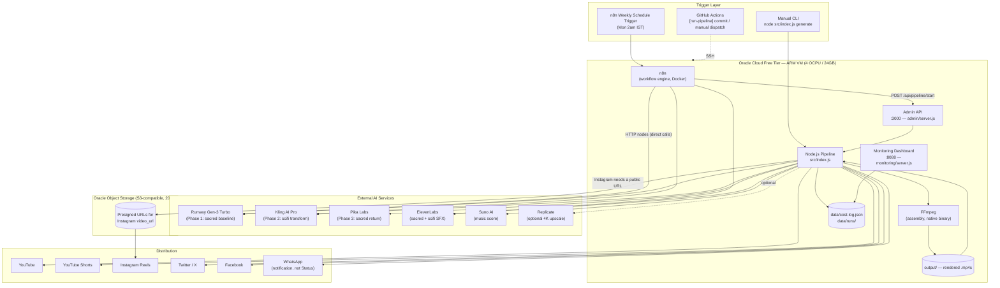
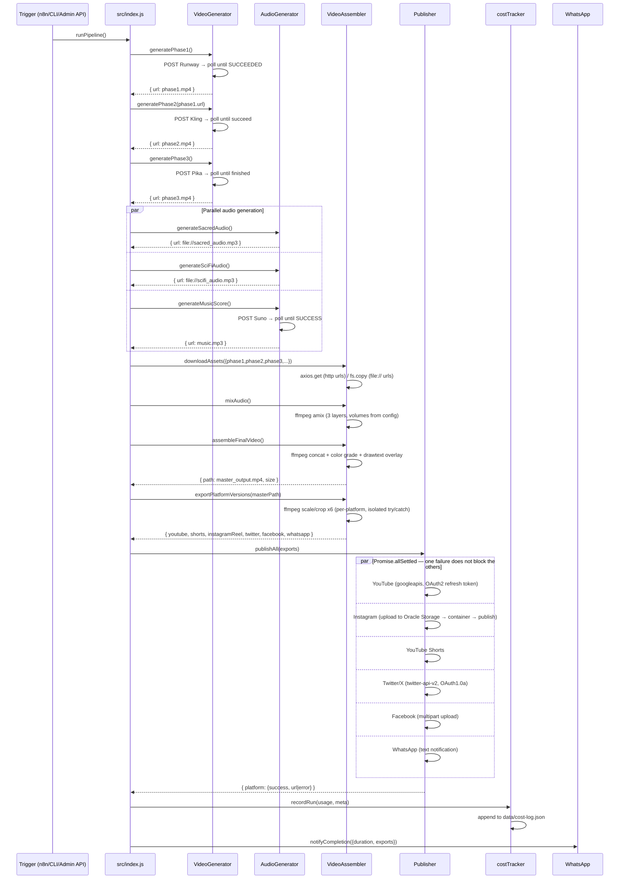
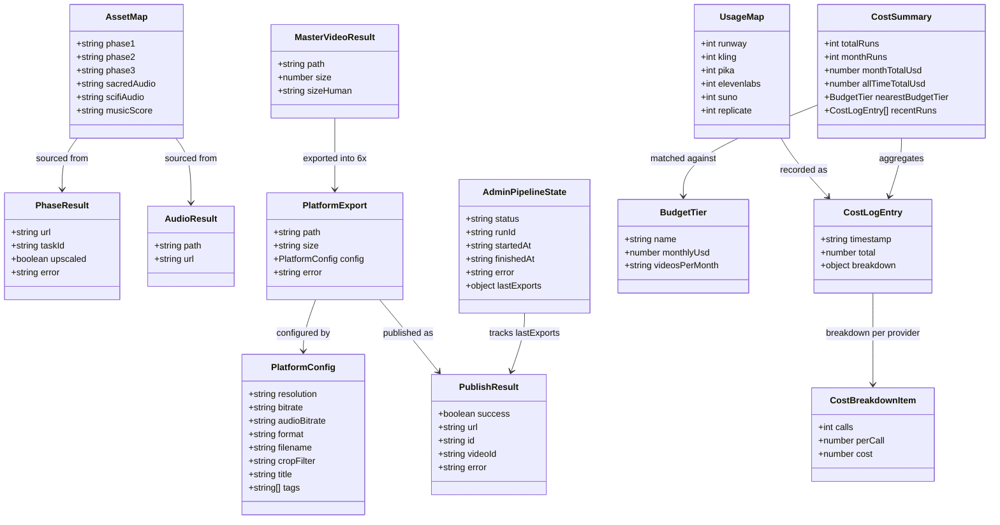

# Jagannatha SciFi Video Pipeline — Technical Implementation Plan

**Project:** 🛸 Jagannatha SciFi Video Pipeline
**Author:** Ashish Gupta — Digital Builders (ashishgupta.dev)
**Status:** Code-complete, unit-tested, committed (`17b69f0`), not yet deployed
**Last updated:** 2026-06-20

---

## 1. What This System Does

A single command (`node src/index.js generate`) turns one static base image of Shree Jagannatha Temple Puri into a 15-second video that opens sacred (diyas, chariots, chanting), transforms into a sci-fi sequence (quantum portals, mechs, a Vimana spacecraft), then returns to sacred stillness — and then publishes that video, re-encoded per platform spec, to YouTube, YouTube Shorts, Instagram Reels, Twitter/X, Facebook, and a WhatsApp notification, in parallel, with per-platform failure isolation.

It runs unattended on an Oracle Cloud Free Tier VM, triggered weekly by an n8n workflow, with GitHub Actions handling deploy-on-push.

---

## 2. What's Been Built — Module Inventory

Everything below exists in the repo, has been read end-to-end during this audit, and (for the modules with tests) passes its unit test suite.

| Layer | File | Responsibility |
|---|---|---|
| Entry point | `src/index.js` | CLI (`generate`, `assemble`, `publish`, `test-apis`, `cost-report`, `schedule`); orchestrates the full run; emits WhatsApp success/failure notification |
| Video gen | `src/video/generator.js` | Runway Gen-3 (phase 1), Kling AI Pro (phase 2), Pika Labs (phase 3), optional Replicate 4K upscale; submit+poll pattern for all four providers |
| Audio gen | `src/audio/generator.js` | ElevenLabs sound-generation (sacred + scifi SFX), Suno AI (music score); submit+poll for Suno, direct response for ElevenLabs |
| Assembly | `src/assembly/assembler.js` | FFmpeg: download assets, mix 3 audio layers, concat 3 video phases + color grade + text overlay into a master file, export 6 platform-specific renditions |
| Publishing | `src/publish/publisher.js` | YouTube + Shorts (googleapis OAuth2), Instagram Reels (Graph API container flow), Twitter/X (twitter-api-v2, real OAuth1.0a), Facebook (Graph API multipart), WhatsApp (Cloud API text notification) — all via `Promise.allSettled` |
| Cost tracking | `src/utils/costTracker.js` | Per-run cost estimate logging to `data/cost-log.json`; month-to-date totals; nearest budget tier lookup |
| Retry | `src/utils/retry.js` | Exponential-backoff wrapper used by every external API call |
| Storage | `src/utils/storage.js` | Oracle Object Storage via AWS SDK S3-compatible client (real SigV4 signing, replacing a non-functional bearer-token stub) |
| YouTube auth | `src/utils/youtubeAuth.js` | OAuth2 refresh-token flow; interactive first-time setup CLI; token validation for `test-apis` |
| Scheduling | `src/utils/cronManager.js` | `node-cron` wrapper for local/fallback scheduling (Asia/Kolkata tz), independent of n8n |
| Notifications | `src/notify/whatsapp.js` | Shared WhatsApp Cloud API sender used by both the pipeline and the publisher |
| Logging | `src/utils/logger.js` | Winston logger, used by every module |
| Config | `config/pipeline.config.js` | Single source of truth: prompts, durations, audio volumes, FFmpeg params, platform specs, retry/poll tuning, cost estimates, budget tiers, storage config |
| Admin UI | `admin/server.js` + `admin/public/` | Express API (`/api/pipeline/start`, `/api/pipeline/status`, `/api/costs`) with API-key auth; this is also what n8n's "Start Pipeline API" node calls |
| Monitoring | `monitoring/server.js` + `monitoring/dashboard.html` | Zero-dependency HTTP server exposing `data/cost-log.json` and `data/runs/` as JSON for the dashboard |
| Orchestration | `n8n/workflows/main-pipeline.workflow.json` | Weekly trigger → start pipeline → per-provider HTTP nodes → FFmpeg assemble → publish → WhatsApp notify |
| Error handling | `n8n/workflows/error-handler-workflow.json` | n8n error trigger → format details → WhatsApp alert → log to file |
| CI/CD | `.github/workflows/deploy.yml` | Lint+test → SSH deploy to Oracle VM → optional pipeline trigger → optional n8n workflow import |
| Ops scripts | `scripts/setup.sh`, `scripts/deploy.sh`, `scripts/test-apis.js` | Oracle VM bootstrap, deploy helper, connectivity check across all 11 external services |
| Tests | `tests/**/*.test.js` | Jest, 6 suites / 51 tests, all passing |

**Bug found and fixed during testing:** `costTracker.getSummary()` had a reversed-array bug that made it always report the highest budget tier ("Pro") regardless of actual spend. Fixed; now correctly returns the smallest tier that covers month-to-date spend.

---

## 3. System Architecture



**Key architectural decisions:**
- **n8n vs. Node CLI overlap is intentional.** n8n's HTTP nodes call providers directly for phases 1–2 and the two ElevenLabs SFX layers (so failures are visible/retryable in the n8n UI); the heavier deterministic work — FFmpeg assembly and multi-platform publish — is delegated back to the Node process via `executeCommand` / the admin API, because that logic is easier to unit-test and version as code than as n8n node graphs.
- **Admin API is the single mutable runtime state.** It's in-memory (`status`, `runId`, timestamps, last error) — acceptable for a single-VM, single-concurrent-run system, but it does not survive a process restart (see §8, Known Gaps).
- **Object Storage is only in the critical path for Instagram**, because Meta's Graph API requires a publicly fetchable `video_url` for Reels; every other platform accepts a direct file upload/stream.

---

## 4. Pipeline Execution Sequence



If any step in the linear chain (phases 1–3, audio, assembly) throws, `runPipeline()`'s outer `try/catch` logs the error, sends a WhatsApp failure notification with the failing stage, and sets `process.exitCode = 1` — it does not attempt partial publishing.

---

## 5. Data Models

These aren't database tables (the system is intentionally stateless/file-based for a free-tier single VM) — they're the shapes that flow between modules. Documented here because every module's contract depends on them matching exactly.



**`data/cost-log.json` on-disk shape:**
```json
{
  "runs": [
    {
      "timestamp": "2026-06-20T02:00:11.000Z",
      "total": 1.92,
      "breakdown": {
        "runway":     { "calls": 1, "perCall": 0.50, "cost": 0.50 },
        "kling":      { "calls": 1, "perCall": 0.70, "cost": 0.70 },
        "pika":       { "calls": 1, "perCall": 0.35, "cost": 0.35 },
        "elevenlabs": { "calls": 2, "perCall": 0.10, "cost": 0.20 },
        "suno":       { "calls": 1, "perCall": 0.20, "cost": 0.20 }
      },
      "exports": ["youtube", "shorts", "instagramReel", "twitter", "facebook", "whatsapp"]
    }
  ]
}
```

**`config.platforms.<name>` shape** (the contract every assembler/publisher function reads): `resolution`, `bitrate`, `audioBitrate`, `format`, `filename`, optional `cropFilter` (vertical formats), optional `title`/`tags`/`caption` (platform-specific metadata).

---

## 6. n8n Workflow Topology

```mermaid
flowchart LR
    subgraph Main["main-pipeline.workflow.json"]
        direction LR
        A["Weekly Schedule Trigger\n(cron)"] --> B["Start Pipeline API\n(POST :3000/api/pipeline/start)"]
        B --> C["Runway — Phase 1"]
        C --> D["Kling AI — SciFi Transform"]
        D --> E1["ElevenLabs — Sacred Audio"]
        D --> E2["ElevenLabs — SciFi Audio"]
        E1 --> F["FFmpeg — Assemble Master\n(executeCommand)"]
        E2 --> F
        F --> G["Publish All Platforms\n(executeCommand)"]
        G --> H["Notify via WhatsApp"]
    end

    subgraph Err["error-handler-workflow.json"]
        direction LR
        X["Error Trigger\n(any workflow failure)"] --> Y["Format Error Details"]
        Y --> Z1["Notify via WhatsApp"]
        Y --> Z2["Log Error to File\n(executeCommand)"]
    end

    Main -.on any node failure.-> Err
```



Pika (phase 3) and Suno (music score) are **not** represented as n8n HTTP nodes — they're triggered inside the Node process when `assemble` or `generate` runs, since they don't gate phase 1→2 sequencing the way Runway→Kling do.

---

## 7. CI/CD Pipeline

```mermaid
flowchart LR
    PUSH["git push main"] --> TEST["Job: Lint & Test\nnpm ci → eslint → jest"]
    TEST -->|pass, branch=main| DEPLOY["Job: Deploy\nSSH → git pull → npm ci --production → docker-compose restart n8n"]
    DEPLOY --> VERIFY["Verify\ndocker-compose ps, node --version"]
    DEPLOY -.->|commit msg contains [run-pipeline] OR manual dispatch=true| RUN["Job: Run Pipeline\nnohup node src/index.js generate &"]
    DEPLOY -.->|commit msg contains [import-n8n]| IMPORT["Job: Import n8n Workflow\ndocker exec n8n n8n import:workflow"]
```

Required GitHub secrets: `ORACLE_SSH_PRIVATE_KEY`, `ORACLE_VM_IP`. Both are still unset — see Next Steps.

---

## 8. Known Gaps / Design Trade-offs (read before deploying)

These are deliberate, documented trade-offs, not bugs — but they directly affect what's safe to rely on at this stage:

- **Admin pipeline state is in-memory.** Restarting `admin/server.js` (e.g. on VM reboot, or the GitHub Actions deploy step restarting docker-compose) loses `status`/`runId`/`error` history. Fine for a weekly single-run cadence; would need a file or SQLite-backed state store before any concurrent or higher-frequency use.
- **WhatsApp "Status" is actually a text notification**, not a real WhatsApp Status post — Meta's Cloud API has no public Status-posting endpoint. The current implementation sends a message to one configured number (`WHATSAPP_NOTIFY_NUMBER`).
- **Kling and Pika have no public lightweight health-check endpoint**, so `scripts/test-apis.js` only validates that their API keys are *present*, not that they're *valid* — a bad Kling key won't surface until the first real Phase 2 generation call.
- **Instagram publishing has a hard dependency on Oracle Object Storage** being configured (`ORACLE_S3_*` env vars) — without it, Instagram is the one platform that can't publish even though the others can.
- **No base image is hosted yet.** `BASE_IMAGE_URL` defaults to a placeholder (`https://your-oracle-storage/jagannath_base.png`) — Phase 1 generation will fail until a real night Rath Yatra image is uploaded to Oracle Storage and the env var updated.
- **Single-VM, single-run-at-a-time design** — there's no queue; a second `/api/pipeline/start` call while one is running is rejected with 409, which is correct for the current cadence but won't scale to multiple concurrent video requests.

---

## 9. Cost Model

| Tier | Monthly | Videos/month | Notes |
|---|---|---|---|
| Starter | $30 | 4–5 | Weekly cadence, no upscale |
| Growth | $100 | 16–20 | ~2x/week |
| Pro | $300 | 55–65 | Near-daily |
| Oracle Cloud (VM + storage) | $0 | — | Always Free tier |

Per-call cost estimates (env-overridable, used because providers don't return real-time billing): Runway $0.50, Kling $0.70, Pika $0.35, ElevenLabs $0.10/call (×2 per run), Suno $0.20, Replicate upscale $0.15 (optional), OpenAI $0.02. A single full run with no upscale ≈ **$1.92**.

---

## 10. Your Next Steps

In rough dependency order:

1. **Push the repo to GitHub.** `git remote add origin <your-repo-url> && git push -u origin main` — nothing downstream (CI, deploy) works without a remote.
2. **Provision the Oracle Cloud Free Tier VM** (ARM, 4 OCPU/24GB) and Object Storage bucket per `scripts/setup.sh`; note the VM's public IP.
3. **Add GitHub secrets**: `ORACLE_SSH_PRIVATE_KEY`, `ORACLE_VM_IP` (Settings → Secrets → Actions) — this unblocks the Deploy job.
4. **Host the base temple image** in Oracle Object Storage and set `BASE_IMAGE_URL` in `.env` — Phase 1 cannot run without this.
5. **Collect and fill in all API keys** in `.env` (copy from `.env.example`; ~50 variables across Runway, Kling, Pika, ElevenLabs, Suno, Replicate, YouTube OAuth, Instagram/Facebook Graph, Twitter, WhatsApp Cloud, Oracle S3). Run `npm run test-apis` after each batch to confirm connectivity.
6. **Run the YouTube OAuth first-time setup**: `node src/utils/youtubeAuth.js`, approve access, paste the refresh token into `.env`.
7. **Apply for the platform permissions that gate publishing**: Instagram Reels + Facebook video publish both require Meta App Review for the relevant scopes; Twitter video upload requires Elevated/Pro API access. Budget lead time here — these are the most likely blockers.
8. **Dry-run the pipeline with `--skip-publish`** (`node src/index.js generate --skip-publish`) to validate phases 1–3, audio, and assembly before risking a live multi-platform publish.
9. **Import the n8n workflows** (`[import-n8n]` commit message, or manually via the n8n UI) and configure n8n credentials for each HTTP node.
10. **Activate the n8n weekly trigger** once a full dry-run and one full live run have both succeeded.
11. **Set up basic VM monitoring** — at minimum, log rotation for `logs/` and a disk-space alert (Oracle Free Tier storage is capped at 20GB and video assets accumulate in `temp/`/`output/`).
12. **Decide on the admin-state persistence gap (§8)** before relying on the admin UI for anything beyond manual one-off runs.

---

*Generated from a direct read of every source file in the repository as of commit `17b69f0` — not from memory of earlier design discussion.*
